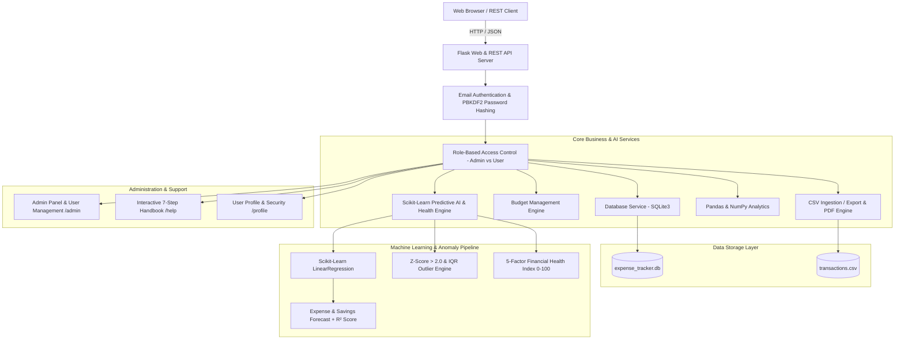

# ExpenseAI — Personal Finance & AI-Powered Financial Analytics System

[](https://www.python.org/downloads/)
[](https://palletsprojects.com/p/flask/)
[](https://scikit-learn.org/)
[](https://pandas.pydata.org/)
[](https://docs.pytest.org/)
[](https://www.docker.com/)
[](LICENSE)
[](https://render.com/deploy?repo=https://github.com/shrihariharan-be/ExpenseAI)

A commercial-grade, portfolio-defining SaaS financial intelligence platform built with **Python, Flask, SQLite, Pandas, NumPy, and Scikit-Learn**. 

Designed to exhibit enterprise software design: role-based access control, administration dashboard, user onboarding, machine learning expense forecasting, statistical anomaly detection, and CI/CD automation.

---

## 🏛️ System Architecture



---

## 🌟 Key Product Capabilities

### 1. 🔐 Realistic Authentication & Security
- **Email-Based Registration**: Full Name, Email verification, live dynamic Password Strength Meter (Weak / Medium / Strong), and complexity policy enforcement (8+ characters, uppercase, lowercase, number).
- **Authentication**: Email/password sign in with "Remember Me" persistent session cookies and realistic password recovery flow (`/forgot-password`).
- **Data Isolation & Ownership Verification**: Strict check on `/edit/<id>` and `/delete/<id>` ensuring users can only manage their own records.
- **User Profile Management (`/profile`)**: Account details, personal portfolio statistics, and secure in-app password changes.

### 2. 🛡️ Administrator Panel & User Management (`/admin`)
- Accessible strictly by users with `role == 'admin'` via `@admin_required` decorator.
- **System KPIs**: Total Users, Total Transactions, Total System Inflow, Total System Outflow, Active Users (logged in within the last 30 days).
- **User Management**: Searchable user table with transaction counts, join dates, last active timestamps, and user account deletion safeguards (prevents self-deletion or deleting primary administrator).

### 3. ❓ Help & Interactive Guide (`/help`)
- Comprehensive 7-card interactive guide with expandable walkthroughs covering:
  1. Add Transactions
  2. View Dashboard
  3. Manage Transactions
  4. Set Monthly Budgets
  5. Financial Analytics
  6. AI Insights & Health Score
  7. Import & Export Reports

### 4. 👋 First-Time User Onboarding
- Guided 3-step welcome banner on the Dashboard for new accounts (`onboarding_completed == 0`).
- Dismissed permanently upon clicking "Get Started &rarr;".

### 5. 🤖 AI Predictive Expense Engine (Scikit-Learn)
- **Time-Series Forecasting**: Trains an Ordinary Least Squares `LinearRegression` model from historical monthly cashflow velocity to predict total projected expenses and future savings for the upcoming month.
- **Model Confidence & R² Score**: Evaluates goodness of fit (\( R^2 \)) and displays model confidence percentage.
- **Historical vs. Predicted Trajectory Chart**: Interactive Chart.js graph plotting actual expenditures and connecting with the AI forecasted trajectory.
- **Category-Level Allocations**: Projects category allocations based on historical spending distributions.

### 6. 🛡️ Multi-Method Anomaly Detection (Z-Score & IQR)
- **Z-Score Detection**: Identifies outlier transactions where \( z = \frac{x - \mu}{\sigma} > 2.0 \).
- **Interquartile Range (IQR)**: Flags expenditures exceeding \( Q3 + 1.5 \times IQR \).
- **Automated Explanations**: Generates contextual explanations (e.g., "3.8x above typical user average").

### 7. 💖 5-Factor Financial Health Score Engine (0–100)
Evaluates financial stability across 5 weighted dimensions:
1. **Savings Rate (30 pts)**: Inflow retention percentage.
2. **Budget Adherence (25 pts)**: Discipline across category monthly limits.
3. **Expense Growth (20 pts)**: Month-over-Month spending velocity control.
4. **Overspending Risk (15 pts)**: Expense-to-income debt exposure.
5. **Spending Consistency (10 pts)**: Coefficient of variation (\( \frac{\sigma}{\mu} \)) of daily expenditures.

### 8. 📊 Data Analytics (Pandas & NumPy)
- Vectorized cumulative running balance calculations using `np.where()` and `np.cumsum()`.
- Average daily burn rate across active date spans.
- Category analysis table with dynamic percentage distribution bars.
- Monthly cashflow analysis table (Income, Expense, Net Savings).

### 9. 📥 Batch CSV Import & 📄 Executive PDF Reports
- **CSV Data Import**: Drag-and-drop file upload with row-by-row sanitization, schema validation, and execution summaries. Downloadable sample CSV template at `/import/template`.
- **Executive PDF Statements**: Downloadable PDF financial reports generated via `reportlab` at `/export/pdf`.

---

## 🔑 Authentication & Environment Configuration

> [!NOTE]
> In production, administrator credentials are configured strictly via environment variables (`ADMIN_EMAIL` and `ADMIN_PASSWORD`) and are never hardcoded or committed to version control.

| Account Type | Access Method | Role | Purpose |
| :--- | :--- | :--- | :--- |
| **System Admin** | Configured via `ADMIN_EMAIL` & `ADMIN_PASSWORD` env vars | `admin` | System KPIs, User Management, Admin Panel |
| **Demo User** | `demo@example.com` / `Demo@123` (Development / Demo sandbox) | `user` | Pre-seeded with 39 multi-month sample transactions |

To configure administrator credentials in production or local environments:
```bash
export ADMIN_EMAIL="your-admin-email@example.com"
export ADMIN_PASSWORD="replace-with-a-strong-password"
```

---

## 📁 Project Structure

```text
expense-ai/
├── app.py                     # Main Flask application, routes & REST APIs
├── config.py                  # System configuration, admin credentials & categories
├── requirements.txt           # Python package dependencies
├── README.md                  # Comprehensive portfolio documentation
├── LICENSE                    # MIT License
├── Procfile                   # Cloud PaaS entrypoint (Render / Railway / Heroku)
├── render.yaml                # Render Blueprint infrastructure configuration
├── runtime.txt                # Target Python runtime (3.11.11)
├── Dockerfile                 # Production multi-worker Gunicorn container
├── docker-compose.yml         # Container orchestration with volume mounts
├── .dockerignore              # Docker build exclusions
├── .gitignore                 # Git ignore rules
│
├── .github/
│   └── workflows/
│       └── tests.yml          # GitHub Actions CI/CD automated test pipeline
│
├── database/
│   └── expense_tracker.db     # SQLite database (auto-created & multi-user schema)
│
├── services/
│   ├── __init__.py
│   ├── database_service.py    # Multi-user SQLite schema, RBAC & queries
│   ├── budget_service.py      # Budget tracking, spent vs limit, alerts
│   ├── ai_service.py          # Scikit-learn ML forecasting, anomaly engine, health score
│   ├── analytics_service.py   # Pandas & NumPy aggregations & running balance
│   ├── import_service.py      # CSV batch validation and ingestion engine
│   ├── pdf_service.py         # ReportLab PDF executive statement builder
│   └── export_service.py      # CSV export and formatting service
│
├── static/
│   ├── css/
│   │   └── style.css          # Responsive design, color tokens, stat cards
│   ├── js/
│   │   └── script.js          # Dynamic dropdowns, Chart.js graphs, UI logic
│
├── templates/
│   ├── base.html              # Rebranded ExpenseAI layout shell & SaaS navigation
│   ├── dashboard.html         # Executive overview, onboarding hero, stat cards & charts
│   ├── login.html             # Clean email-based login with Remember Me
│   ├── register.html          # Registration with live password strength meter
│   ├── forgot_password.html   # Password recovery interface
│   ├── profile.html           # User profile, portfolio stats & password change
│   ├── admin.html             # Administrator dashboard & user management
│   ├── help.html              # Modern 7-step interactive user handbook
│   ├── budgets.html           # Budget dashboard, progress bars, compare chart
│   ├── insights.html          # AI ML predictions, health score, anomalies, trend chart
│   ├── transactions.html      # Transaction CRUD, multi-criteria filters, delete modal
│   ├── add_transaction.html   # Add transaction form with dynamic categories
│   ├── edit_transaction.html  # Edit transaction form
│   ├── analytics.html         # Pandas analytics dashboard, tables & charts
│   ├── reports.html           # Periodic statements (Daily/Weekly/Monthly/Custom)
│   └── import.html            # CSV file upload with validation report
│
├── tests/
│   ├── conftest.py            # Pytest fixtures and isolated user/admin clients
│   ├── test_auth.py           # Email registration, password strength, login, recovery
│   ├── test_admin.py          # RBAC, system KPIs, user deletion, self-deletion guard
│   ├── test_database.py       # CRUD operations and user data isolation
│   ├── test_budget.py         # Category budgets, limits, and alerts
│   ├── test_analytics.py      # Pandas & NumPy calculations, running balances
│   ├── test_ai.py             # Scikit-learn LinearRegression, R² & anomaly tests
│   └── test_routes.py         # Web endpoints, CSV import, PDF, REST APIs & ownership
│
└── data/
    └── transactions.csv       # Exported transaction records
```

---

## 🚀 Getting Started

### Local Development

1. **Install Dependencies**:
   ```bash
   pip install -r requirements.txt
   ```

2. **Start the Application**:
   ```bash
   python app.py
   ```

3. **Open Browser**:
   Visit [http://127.0.0.1:5000](http://127.0.0.1:5000).

---

### 🧪 Running Automated Tests

Run the complete 41-test automated test suite using `pytest`:

```bash
pytest -v
```

Expected Output:
```text
test_app.py::TestExpenseTracker::test_01_database_and_seed_data PASSED   [  2%]
test_app.py::TestExpenseTracker::test_02_crud_operations PASSED          [  4%]
test_app.py::TestExpenseTracker::test_03_transaction_validation PASSED   [  7%]
test_app.py::TestExpenseTracker::test_04_filtering_and_search PASSED     [  9%]
test_app.py::TestExpenseTracker::test_05_pandas_and_numpy_analytics PASSED [ 12%]
test_app.py::TestExpenseTracker::test_06_flask_web_routes PASSED         [ 14%]
test_app.py::TestExpenseTracker::test_07_api_json_endpoints PASSED       [ 17%]
test_app.py::TestExpenseTracker::test_08_empty_database_handling PASSED  [ 19%]
tests/test_admin.py::test_admin_role_access PASSED                       [ 21%]
tests/test_admin.py::test_admin_system_stats_and_user_management PASSED  [ 24%]
tests/test_ai.py::test_ai_predictive_engine PASSED                       [ 26%]
tests/test_analytics.py::test_analytics_calculations PASSED              [ 29%]
tests/test_apk_audit.py::test_api_health_endpoint PASSED                 [ 31%]
tests/test_apk_audit.py::test_release_apk_exists_and_signed PASSED       [ 34%]
tests/test_apk_audit.py::test_release_apk_binary_free_of_developer_ips PASSED [ 36%]
tests/test_apk_audit.py::test_network_security_config_enforces_https PASSED [ 39%]
tests/test_auth.py::test_registration_and_login PASSED                   [ 41%]
tests/test_auth.py::test_duplicate_user_validation PASSED                [ 43%]
tests/test_auth.py::test_forgot_password_flow PASSED                     [ 46%]
tests/test_auth.py::test_auth_status_and_root_navigation PASSED          [ 48%]
tests/test_auth.py::test_direct_protected_url_access_denied_when_logged_out PASSED [ 51%]
tests/test_auth.py::test_admin_route_access_restriction PASSED           [ 53%]
tests/test_auth.py::test_logout_invalidates_session_and_sets_cache_headers PASSED [ 56%]
tests/test_budget.py::test_budget_management PASSED                      [ 58%]
tests/test_database.py::test_database_seeding_and_crud PASSED            [ 60%]
tests/test_database.py::test_user_data_isolation PASSED                  [ 63%]
tests/test_database.py::test_input_validation PASSED                     [ 65%]
tests/test_production.py::test_pwa_manifest_and_icons PASSED             [ 68%]
tests/test_production.py::test_pwa_service_worker_and_offline PASSED     [ 70%]
tests/test_production.py::test_production_error_handlers PASSED          [ 73%]
tests/test_production.py::test_sqlite_indexing_and_wal PASSED            [ 75%]
tests/test_production.py::test_ai_insufficient_data_handling PASSED      [ 78%]
tests/test_production.py::test_csv_duplicate_prevention PASSED           [ 80%]
tests/test_production.py::test_apk_download_endpoint PASSED              [ 82%]
tests/test_routes.py::test_web_routes PASSED                             [ 85%]
tests/test_routes.py::test_csv_import_route PASSED                       [ 87%]
tests/test_routes.py::test_pdf_export_route PASSED                       [ 90%]
tests/test_routes.py::test_rest_apis PASSED                              [ 92%]
tests/test_routes.py::test_help_profile_and_onboarding PASSED            [ 95%]
tests/test_routes.py::test_transaction_ownership_authorization PASSED    [ 97%]
tests/test_routes.py::test_api_authentication_and_financial_data_isolation PASSED [100%]

============================= 41 passed in 3.64s ==============================
```

---

## 📄 License
This project is licensed under the MIT License — see the [LICENSE](LICENSE) file for details.
